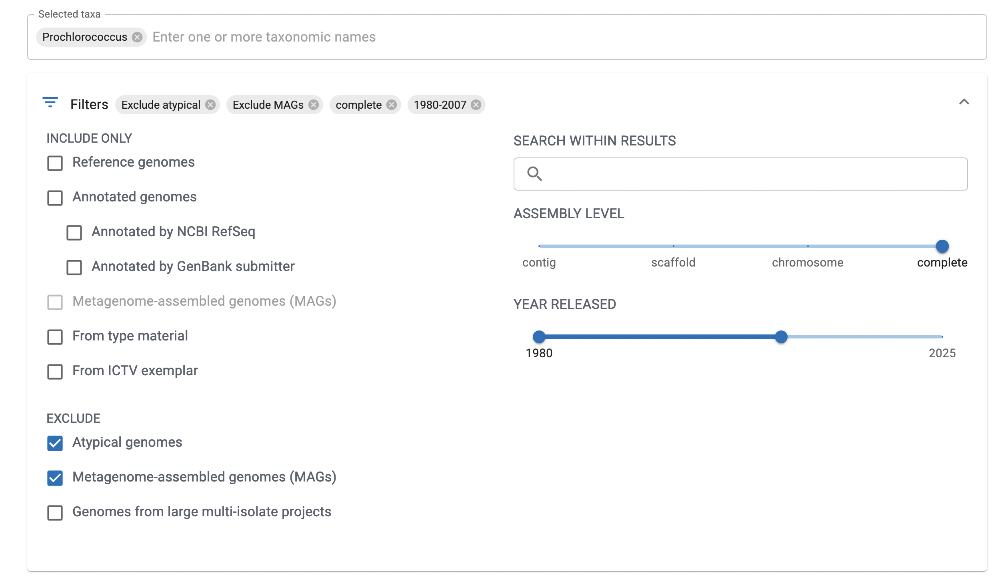

# Homework 2: Working with sequence data

*Prochlorococcus* is one of the most globally abundant photosynthetic organisms. Though largely indistinguishable under a microscope, strains often differ in subtle but ecologically important ways. An example of these niche defining differences include how they acquire and use nutrients such as phosphorus. Some genomes encode additional pathways for scavenging phosphorus (such as phosphonate transport or alkaline phosphatases), while others rely only on inorganic phosphate uptake.

In this assignment, you will explore the diversity of *Prochlorococcus* by comparing the genomes of multiple isolates. While marker genes like 16S are often used to assess taxonomy in bacteria, Pro is typically ~97% identical at the 16S. To get around this, you will look at genome-wide relatedness using both Average Nucleotide Identity (ANI) and k-mer comparison. You will also examine these genomes to characterize their functional diversity with regards to phosphorus metabolism.

First of all, start an `srun` session on the HPC. You shouldn't need a huge amount of memory (20Gb will more than suffice). Next, make a conda environment that has the tools we will be using:

```
mamba create -c bioconda -c conda-forge -n homework2 sourmash>=4.0 blast hmmer fastani jupyterlab matplotlib seaborn pandas mummer
```

## Part A. Preliminary: Getting genomic data from NCBI

First, let's grab some genomes. Go to the genome browser from the NCBI: https://www.ncbi.nlm.nih.gov/datasets/genome/. This is a tool that allows you to look up genomes by taxonomy (a super useful tool). Search for *Prochlorococcus*. As you can see-- there are a *lot* of Pro genomes. Let's filter the results to only select for complete genomes (1 contig, and often circularized for bacteria) and exclude Metagenome-assembled genomes (MAGs) (these are useful but can be a bit messier or contaminated):



This should reduce the number of genomes to ~71. We don't need that many so let's just take genomes that were released between 2003 and 2007 and *earlier* (there should be 11). You can use the slider under the filter to narrow the date range. Select all of those entries and go up to the blue Download button and select "Download Package". We want to pull 1) the genome sequences, 2) the predicted proteins, and 3) the Annotation features (GFF) for each of our genomes. Futhermore select RefSeq only (or it will duplicate the download and download examples from both GeneBank and RefSeq). Provide a name (like `Prochlorococcus.zip`) for the download file.


It is useful to have sequences from organisms other than the organism we are interested in. Repeat the process above and download the genomic information from *two other* bacteria (pick your favorites!). You should pull the same files (genome, proteins, GFF). Give the zipped files some sort of useful name.

Next, use *scp* to transfer all your files to the HPC to a folder called `data/` in your homework repository. Unzip all the folders and look at the contents.

**How are the data structured?**
> ANSWER HERE

Let's copy all the genome files into a new directory in data called `genomes_sequences`. BUT rather than copying data needlessly we can use the command `ln -fs <file_location> <destination>`. This will link the file in a new location but won't actually copy the contents of the file. Do this for all the genomes (Pro and the other Bacteria).

**What command did you use?**
```
YOUR CODE HERE
```

**Could you do this same operation for the protein files? Why or why not?**
> ANSWER HERE

## Part B. Rapid genome comparison using K-mers: Sourmash!

Now let's see how related these genomes are! As a first pass we are going to use [Sourmash](https://sourmash.readthedocs.io/en/latest/). Sourmash is a bioinformatics toolkit for fast, alignment-free (i.e. no BLAST required) sequence comparison.

At its core, sourmash uses [k-mer](https://en.wikipedia.org/wiki/K-mer) sketches (based on the MinHash algorithm) to represent DNA, RNA, or protein sequences. Think of it a bit like creating a barcode (that is much smaller than the original dataset) that represents a subset of the data. By comparing the barcodes from different datasets we can rapidly estimate how similar the data are without having to work with the full sized datasets or run slower algorithms.

The first step is to create sourmash sketches from each of our genomes. This is done with the `sketch` command. Here are details on how to use the `sketch` command: https://sourmash.readthedocs.io/en/latest/sourmash-sketch.html. You should write a for loop that will loop over each of the genome files and create a sketch that is scaled to 10000 for k=31. Output all files to a new directory called `sourmash` within the `genome_sequences` folder. Name them based on the original file name but add a `.sig` extension.

```
PASTE YOUR FOR LOOP HERE
```

Take a look at your output.

**How do the files sizes of the signature files compare to the original genome file sizes? What do you see reported in the .sig files?**

> ANSWER HERE

Now that we have created the signatures you can do all sorts of things like estimate taxonomy using their databases, query large datasets, or (as we are going to do) quickly compare a set of genomes.

Move into the `sourmash/` folder and run the following commands to estimate the [Average Nucleotide Identity (ANI)]() between each genome:

```
# Estimate the ANI between samples
sourmash compare *sig --ani --output sourmash.ani.k31.compare --csv  sourmash.ani.k31.compare.csv
# Create a very rough plot
sourmash plot ani.k31.compare --vmin .7  #try adjusting the vim value to see what happens
```

Copy `sourmash.ani.k31.compare.csv` and all your associated `.png` to `results/`.

**What do you observe? What is the ANI between Pro and your outgroup? What is the range in ANI between Pro strains? How accurate do you think this is?**

> ANSWER HERE

There are several tools that will estimate ANI for you including [fastani](https://github.com/ParBLiSS/FastANI). There is a nice [online GUI version of fastani here](https://gtdb.ecogenomic.org/tools/fastani?job-id=1).

Using fastani on the command line or with the online GUI, calculate the ANI for our genomes. Save the output of the fastani analysis as `fastani-ani.csv` in `results/`.

If you use the command line report your code here:

```
HERE
```

If you used the GUI save a copy of the heatmap in your `results/` folder.

**Are fastani's estimated ANI values the same or different than those output by sourmash?  Why? Look at the values for Pro vs your other bacterial genomes.**

> ANSWER HERE

**BONUS** Create a scatter plot of sourmash pairwise ANI values compared to ANI values returned by the tool that you chose. Upload the scatter plot and the code you used to generate it to the `results/`

## Part C. Comparing functional potential across genomes

Now let's take a look at functional potential differences across our genomes. Navigate to the *Prochlorococcus* folder that contains your GCF folders. All the protein files are named `protein.faa`. Let's go ahead and change all the names to the strain name of the genomes. I have created a file (`resources/accession_to_strain.tsv`) that translates the genome file name to the strain name. Use the script below to change all the names. Update the path to the accession file and run the following for loop.

```
for x in $(cat /path/to/accession_to_strain.tsv); #loop through file
  do
  gc=${x%;*}; #get GCF/A number
  s=${x#*;}; #get strain name
  mv $gc/protein.faa $gc/$s.protein.faa; #rename the file
  done
```

Check the names of your protein files-- they should have been renamed based on the strain name for the organism. Make a new folder called `proteins/` and link all your protein files into that folder.

In a folder called `phosphorus-genes`, you will find resources for two genes associated with phosphorus metabolism in bacteria: 1) **phoA**, an alkaline phosphatase which cleaves phosphate off of phosphate esters, and 2) **phoB**, a transcriptional response regulator. For both of these genes I have provided the amino acid sequence for the proteins in *E. coli* (where these proteins were originally characterized and identified) as well as an hmm profile.

First, use the provided amino acid sequences to query the protein files for phoA and phoB with blastp. (HINT: You are going to need to generate blast database and then run your searches for each strain. For loops might be useful here; you might also find [this](https://open.oregonstate.education/computationalbiology/chapter/command-line-blast/) useful and want to modify the default output format). Save each of your outputs to your `results` folder as `[strain].[gene].blastp.out`.

**Insert your code below:**

```
CODE USED FOR BLASTDB GENERATION + BLASTP
```

Now, use the two hmm profiles that are provided to search for phoA and phoB. Again, you might want to consider outputting a table as well as the typical hmm output. Save each of your outputs to your `results` folder as `[strain].[gene].hmm.out`.

**Insert your code below:**

```
CODE USED FOR HMM PROFILING
```

Now it is time to look at your results. Generate a table where you predict for each strain the presence (and copy number) or absence of PhoA and PhoB. Do this both based on your BLAST results and your HMM results. Save the tables in your results folder as two csv or tab separated files (`phoA-presence.csv` and `phoB-presence.csv`).

**How did you make a decision for predicting gene presence/absence based on the outputs from BLAST? What about HMM?**

> ANSWER HERE

**Are your predictions of gene presence/absence consistent between the two methods? Why or why not? What does this tell you about the two methods and how and where each might be best applied?**

> ANSWER HERE

## You are done!
For this assignment please push the updated `README.md` file as well as your `results/` which should contain your ANI matrices done with sourmash and fastani, all figures generated for the ANI calculations, the outputs of HMM and BLAST searches, the predicted presence and absence of the genes across the strains. Finally, report how long this assignment took you. 
